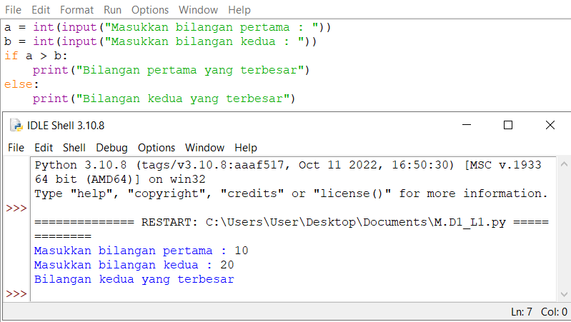
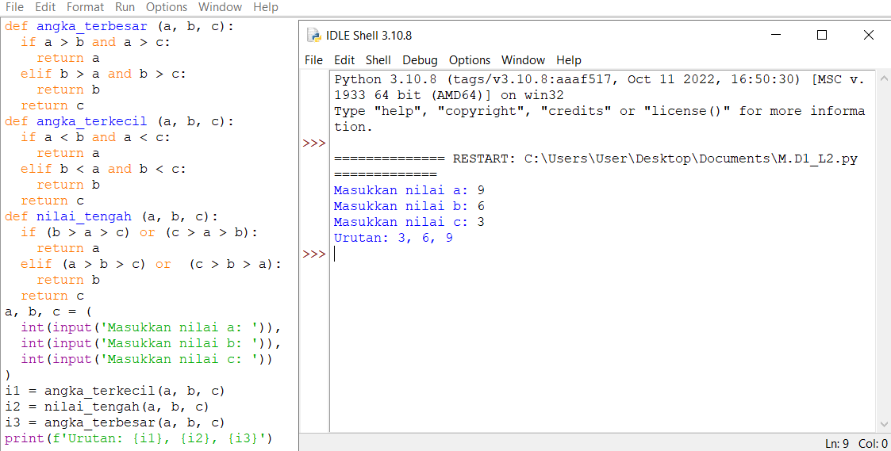
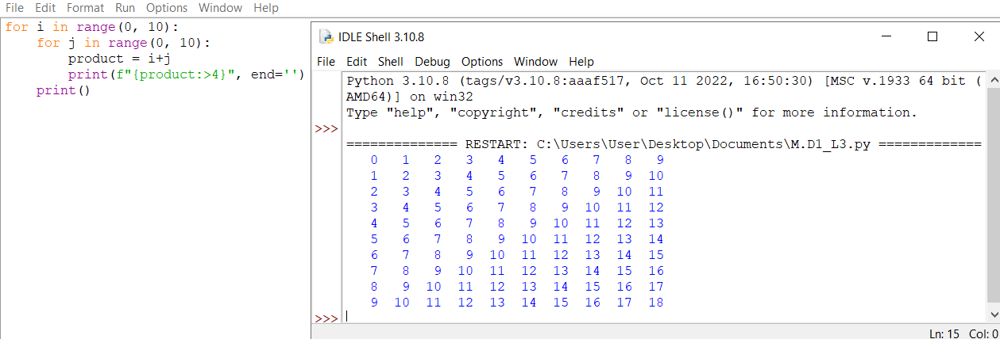
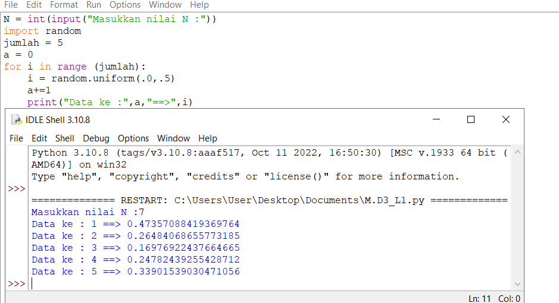

# PRAKTIKUM 4
# Lab1
## Tugas 1
- ketik (int) untuk memuculkan bilangan bulat
```
a=int(input("Masukkan bilangan pertama : "))
b=int(input("Masukkan bilangan kedua : "))
```
- lalu masukan statement (if) a>b
```
if a > b:
```


## Tugas 2
- buat (def) dari angka terbesar,tengah,dan terkecil
```
def angka_terbesar (a, b, c):
  if a > b and a > c:
    return a
```
- untuk membuat nilai terkecil ganti tanda (>)menjadi(<)
- untuk nilai tengah tutup statement besar dan kecil a,b,c
```
def nilai_tengah (a, b, c):
  if (b > a > c) or (c > a > b):
    return a
  elif (a > b > c) or  (c > b > a):
    return b
  return c
  ```
  
  
  ## Tugas 3
  
  - buatlah 2 variable dengan jarak (0,10)
  ```
  for i in range(0, 10):
    for j in range(0, 10):
  ```
  - lalu gabungkan 2 variable menjadi satu dengan (+)
  - masukan perintah peformatan string untuk memberi parameter jarak yang bisa di atur sesuai keinginan
  ```
  product = i+j
        print(f"{product:>4}", end='')
    print()
  ```
  
  
  ## Tugas 4
  - masukan nilai n dengan (int) 
  - masukan perintah import random untuk memasukan pilihan 
 ```
  N = int(input("Masukkan nilai N :"))
import random
jumlah = 5
```
- setelah itu masukan nilai a dengan bilangan bulat mulai dari 0
- lalu bikin variable i dan masukan perintah range 
- ketik perintah random uniform
```
a = 0
for i in range (jumlah):
    i = random.uniform(.0,.5)
    a+=1
```

